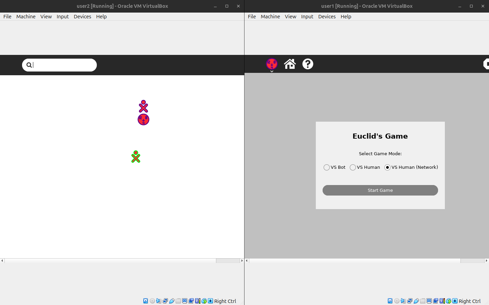
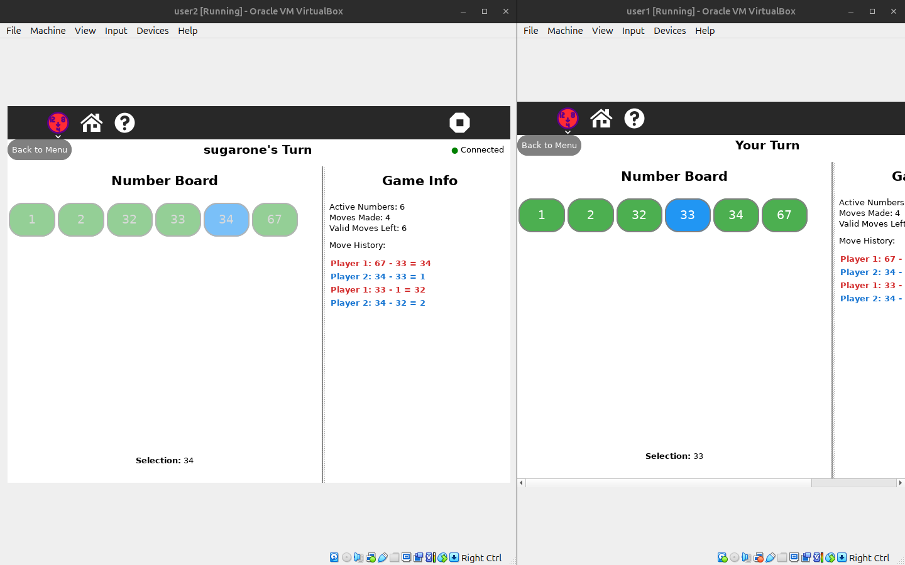

# Euclid's Game


## 🎯 Overview

Euclid's Game is a mathematical strategy game based on the famous Euclidean algorithm for finding the greatest common divisor (GCD). This engaging game combines logical thinking, strategic planning, and mathematical reasoning to create an educational yet entertaining experience that demonstrates fundamental mathematical concepts through gameplay.






## How to Use

For a step-by-step walkthrough, see the official documentation on installing activities:

[How to Install Activities – Sugar Labs Wiki](https://wiki.sugarlabs.org/go/How_to_install_activities)

Alternatively, for development or testing purposes, you may clone or copy the activity directory into your `~/Activities` folder and then restart Sugar to have it appear in the activity ring:

```bash
git clone <repository-url> ~/Activities/<activity-name>

cp -r /path/to/local/activity ~/Activities/
```